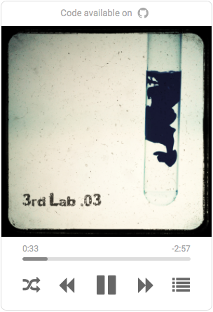
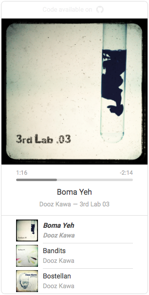

# audio-player

An audio player app built in HTML5 / CSS3

All the tracks in the `media/` directory are available under open source license and can be found at:

- [3rdLab](http://3rdlab.net/fr/)
- [Free Music Archive](http://freemusicarchive.org)
- [Jamendo Music](https://www.jamendo.com)

Clone this repository and enjoy !
If you want to put your own music, put the mp3 in the `media/` directory and the album cover in `imgs/`. Do not forget to edit tracks metadata in the `index.html` (from the line `<!-- SONGS PLAYLIST -->`).

**Note:** An automatic metadata tracks editor will soon be available (based on the `exiftools` software).
